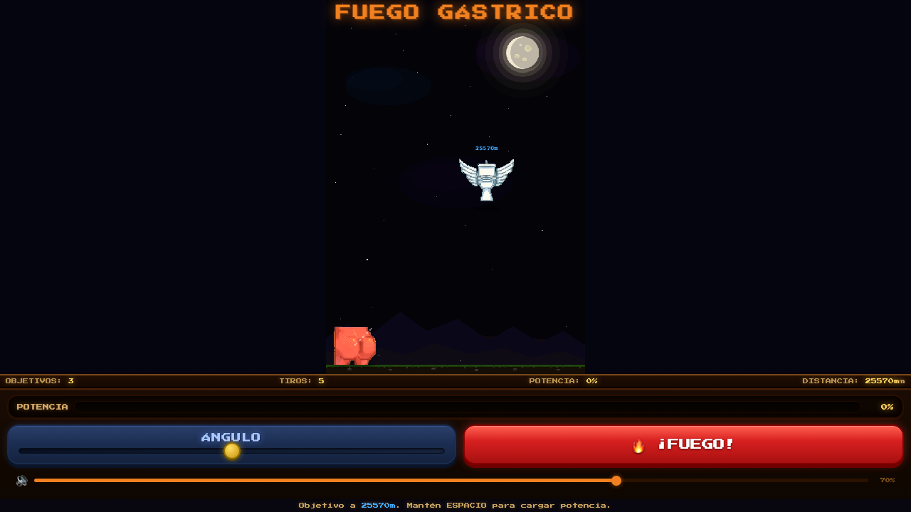

# 🚽 Fuego Gástrico

> El héroe que nadie pidió... una misión embarrada.

Un juego de artillería arcade hecho en un solo archivo HTML: cargá potencia, ajustá el ángulo y disparate a vos mismo contra un inodoro ángel que flota en el cielo. Sin build, sin dependencias, sin excusas.

**Jugalo online:**
- 🎮 [fuego-gastrico.vercel.app](https://fuego-gastrico.vercel.app/)
- 🎮 [juancasareto.github.io/low-bit-flatulence](https://juancasareto.github.io/low-bit-flatulence/)



## Cómo se juega

1. Elegí tu personaje (Don Tapón, Maximus Rollius o Sir Flatulento).
2. Mantené presionado **ESPACIO** (o el botón **🔥 ¡FUEGO!** en mobile) para cargar potencia.
3. Ajustá el **ÁNGULO** con el slider.
4. Soltá para disparar y tratar de entrar al inodoro enemigo, en caída, desde arriba.
5. Superá los niveles: cada uno suma viento, vidas límitadas y objetivos que se mueven.

## Stack

HTML + CSS + JavaScript vanilla, todo en [`index.html`](index.html). Audio 100% procedural vía Web Audio API (sin archivos de sonido). Física de proyectil simple (gravedad + ángulo + potencia).

## Correr localmente

No hay build step. Cualquiera de estas funciona:

```sh
npx serve -p 5500 .
# o
python3 -m http.server 5500
```

Después abrí `http://localhost:5500`.

## Estructura

```
index.html   → todo el juego (HTML, CSS, JS)
CLAUDE.md    → guía técnica del proyecto para desarrollo asistido
progress.md  → bitácora de features implementadas
```

## Licencia

[MIT](LICENSE)
